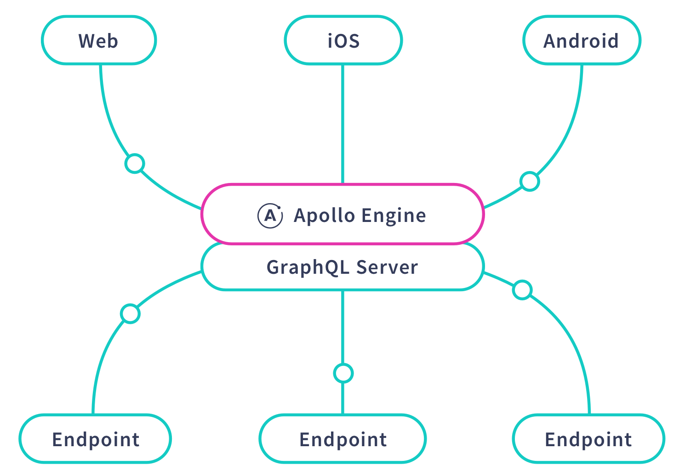

[Apollo Engine](https://www.apollographql.com/engine/) is a GraphQL toolkit that enables you to understand, optimize, and control your GraphQL service.

Engine combines information from our schema registry and performance reports to illuminate the state of your GraphQL service and deliver essential capabilities like schema management, usage analytics and alerting.

You can get started with Apollo Engine using any GraphQL server, but pair Engine with Apollo Server to gain control over your GraphQL schema right out of the box.

  

To find out more about Apollo Engine's features, read through the [feature guides](./features/).  Then, get started with uploading your first schema by clicking below!

 
 

  

