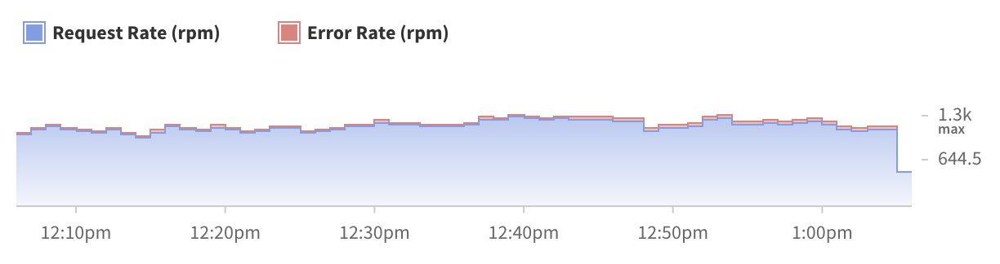
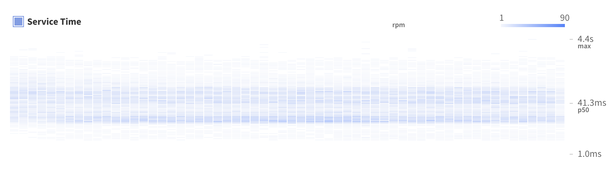
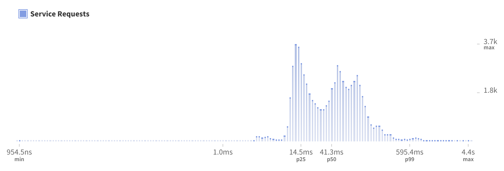

The first feature of Engine, and one of the most commonly used, is the ability to get fine-grained insight into the performance of your GraphQL execution. Without GraphQL, performance is often tracked on a per-endpoint basis, now that your data is accessed through GraphQL queries that approach isn't as effective.

Engine's performance insights are focused around two main concepts:

1. GraphQL operations (queries and mutations)
2. Fields and resolvers

Engine takes advantage of the GraphQL concepts above so that you can get really fine-grained insight into your server's performance and how it relates to your UI without complicated setup.

<h2 id="charts">Charts</h2>

Once you select an operation in the Engine UI, you'll see three main charts. We've selected these based on conversations with customers to display the most important data you need to know about your server's performance.

<h3 id="volume">Volume chart</h3>

This chart shows request and error volume in requests per minute (RPM) over time.

<h3 id="heat-map">Heat map</h3>

This chart shows every GraphQL operation from your clients in your selected time range. The horizontal axis is time, and the vertical axis shows how long the operation took. Faster response times are at the bottom, slower at the top. Darker colors represent larger request volume. This chart shares a horizontal axis with the volume chart above it.

<h3 id="histogram">Histogram</h3>

This chart shows a distribution of how long every GraphQL operation took in your selected time range. The horizontal axis shows how long the operation took, and the height of the bars reflect how many requests fell into each duration range. Every bar represents the sum of a row in the heatmap chart above.

<h2 id="trace">Trace view</h2>

TODO

TODO: add links to blog posts
