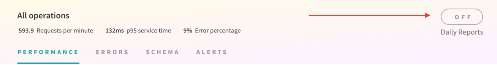

With Engine, you can get a birds-eye view of your GraphQL API delivered on a daily basis to the Slack channel of your choice. Here's what an Engine Slack report looks like:

In this docs page, we'll go over how to set up reports for a service in Engine, and how to use some of the data presented in the report.

<h2 id="setup">Setting up reports</h2>

First, click on the button in the top-right of the service for which you want daily reports:

You'll see a popup like below:

Now, let's follow the directions in the popup to set up a service.

1. Visit the [Incoming Webhooks app](https://my.slack.com/services/new/incoming-webhook/) for your team.
2. Select the channel you want Engine to post to.
3. Click "Add Incoming Webhooks Integration".
4. Copy the "Webhook URL" on the next screen.
5. Paste it into the "Slack Webhook URL" field in the form in the Engine UI.
6. Click "Update".

At this point, you should receive a confirmation message from Engine in the Slack channel you selected, that looks much like this:

If you don't receive a confirmation, please reach out to [support](mailto:support@apollodata.com) so we can help you get things set up!

After a few minutes to an hour, you should see your first report show up in the Slack channel. Congratulations! You'll now get a report from Engine every day at 9 am Pacific time.

<h2 id="usage">Using the report</h2>

We've constructed the report provided to give you an actionable summary of what's happened in your API in the last 24 hours. Here’s how you can use it to identify issues:

1. **Request rate:** This shows you how many queries are hitting your server every minute, along with a list of the most popular operations. If you see a huge dip in this, it might mean queries aren’t able to reach your server, or some client is down.
2. **p95 service time:** This shows you how long queries are taking to execute. We selected p95 since it’s the best overall representation of how your users are experiencing your app. You can use this to identify that your API is overloaded and users are seeing long loading delays, or to find out which queries are taking the longest to run.
3. **Error percentage:** This will show you how many of your GraphQL requests end up with an error result. Spikes in errors might be the result of some underlying backend malfunctioning. You can also see which of your operations are most error-prone.

<h3 id="click-operation">Getting operation details</h3>

Each operation that appears in the report is a link, so you can get right from the report in Slack to the relevant view in Engine to get more details about the issue. For example, you might want to look at the [trace view](./performance.html) to debug a performance problem, or the [error page](./error-tracking.html) to get the message and reproduction info for a common error.
